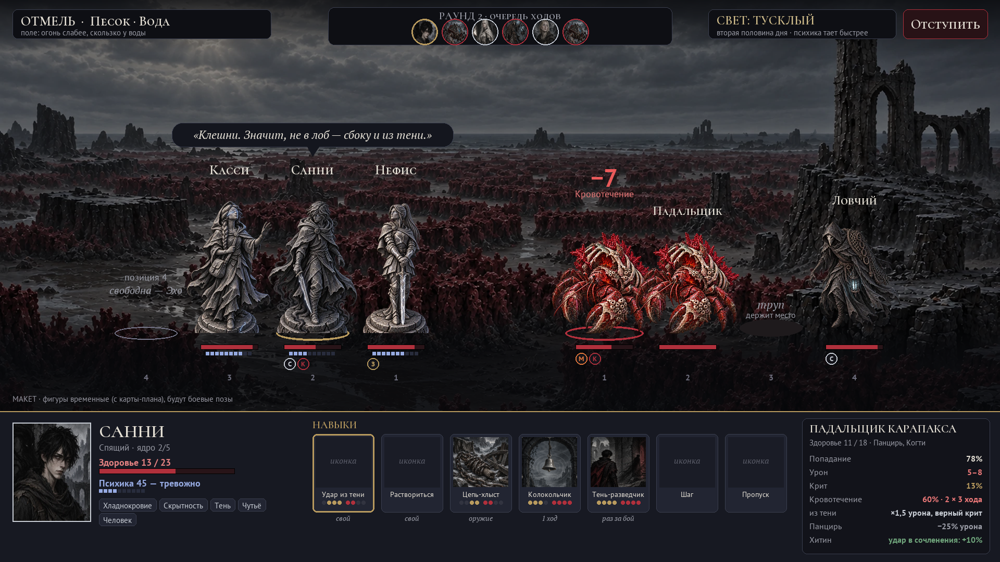

# Design Spec — “Skirmish” Turn-Based Combat (modelled on Darkest Dungeon)

**Version 0.2 · 06 Oct 2026 · status: owner's decisions accepted (28 answers); spec for phased implementation.**
English translation of `docs/24 — Пошаговый бой «Схватка».md` (the Russian original is the master copy). Word versions: `docs/ТЗ — Пошаговый бой «Схватка».docx` (Russian) and `docs/Design spec — Turn-based combat Skirmish (EN).docx` (English); both are built with `python tools/gen_skirmish_docs.py`. Art prompts: `docs/Пошаговый бой — промты ChatGPT.docx`.

> In short. SunLess combat becomes a turn-based battle in formation, modelled on Darkest Dungeon. Up to four heroes on the left, up to four enemies on the right; every fighter has a position, health, psyche and status effects. On a hero's turn the player picks a skill and a target. Skills come from the hero (two of their own), their weapon, every ability card and every card in the hero's pocket. Tags become properties of fighters and of strikes; the tag link web stays. Death's Edge, psyche, the sky, the camp and the Soul Core already exist in the game — they take the places of the matching Darkest Dungeon mechanics. The old auto-battle “Clash” keeps working until “Skirmish” is ready; then it is removed.

Related: [[12 — Combat system, tags and the living campaign]] (tags, links, ranks), [[16 — Main gameplay — phases 7–14]] (psyche, Edge, Memories), [[18 — Figure — movement and camp]] (camp, half-days), [[23 — Soul Core]] (hero ranks).

# 1. Owner's decisions

| # | Question | Decision |
|---|---|---|
| 1 | Who controls combat | Turn-based, like Darkest Dungeon: on a hero's turn the player picks a skill and a target. Replaces the rule “auto-battle without intervention” |
| 2 | How many fighters | 4 vs 4; a fight can also be 1 vs 4; an Echo also takes a position |
| 3 | Health | Health + Death's Edge: at 0 the hero is on the Edge and still fights; any hit on a hero on the Edge triggers a death roll. Wounds last until the camp |
| 4 | Stress | Psyche = DD stress: attacks on the mind, crits, darkness and the deaths of comrades hit the psyche during battle; 0 → crisis |
| 5 | Where skills come from | Mixed: 2 of the hero's own skills + weapon + ability cards |
| 6 | Enhancement cards | Every card is an active skill in battle |
| 7 | Tags | Properties of the fighter and of the strike: resistances, vulnerabilities; tag links change a specific strike; the link web stays |
| 8 | Stats | Combat parameters are derived from Power, Will and Cunning |
| 9 | Positions | Skills used from and against positions; moves (push, pull, step); large enemies take 2 positions; corpses hold their place |
| 10 | Status effects | Bleed and blight, stun, mark, guard, riposte, stealth — plus similar mechanics invented for SunLess |
| 11 | Light | Light = the sky and the time of day |
| 12 | Battle length | To the end + retreat |
| 13 | How many skills | All at once: choosing skills = choosing the cards in the pocket (changed anywhere except in battle) |
| 14 | Limits on card skills | By card power: common — free, rare — cooldown, epic and legendary — once per battle or at a cost |
| 15 | Enemy skills | From tags + manual tuning; elites and bosses get special hand-made skills |
| 16 | Ambush | Yes, from the event and from tags |
| 17 | Battle view | Full-height figures, side view (like DD); cards live in the bottom panel |
| 18 | Animation | Pose frames + camera zoom |
| 19 | Art style | Like the SunLess cards |
| 20 | Backgrounds | By type of place (battlefield) within the region |
| 21 | New vs old combat | Replace completely, but only once ready; until then — a switch |
| 22 | Echo | Takes a free position, has its own health and 2 skills, no psyche. If it dies, the card crumbles. A third skill, “Recall”, pulls the Echo out of battle so it is not destroyed |
| 23 | Crisis in battle | Like DD — behaviour: a panicking hero acts on their own according to their tags; an uplifted hero helps others |
| 24 | Skill growth | Through what already exists: Soul Core, tag evolutions, card levels, sharpening |
| 25 | Numbers | On hover: bars and icons on screen, hit chance and damage as numbers on hover; damage pops up as numbers |
| 26 | Camp | Camp skills at night |
| 27 | Difficulty | Hard but fair |
| 28 | Field and round card | The field stays for the whole battle; a field event every 2–3 rounds |

# 2. How Darkest Dungeon combat works

Analysis based on the first game (Darkest Dungeon, 2016); where the second game differs, it is noted separately. Figures are from the game wiki (links in section 14).

## 2.1. Components

- **Formation.** A party of four heroes stands in a column: position 1 is the front, closest to the enemy; position 4 is the back. Opposite them stand up to four enemies in their own formation. Large enemies take two positions.
- **Classes and skills.** About seventeen hero classes (Crusader, Vestal, Plague Doctor, Highwayman…). A class has seven combat skills, of which four are taken on an expedition; everyone also has “Move” (shift one position) and “Pass”.
- **A skill** defines: which positions the hero can use it from, which positions it hits (enemy or ally, one target or several positions at once), accuracy, damage modifier, crit bonus and effects: bleed, blight, stun, move, mark, guard an ally, riposte, heal, stress heal, buffs and debuffs, stealth.
- **Fighter stats:** health, dodge, protection (damage reduction in %), speed, accuracy, crit chance, damage range. **Resistances:** stun, blight, bleed, disease, move, debuff, death blow, traps.
- **Two “health bars”:** the body (health) and the mind (stress 0–200).
- **Torchlight** 0–100: burns down during the expedition, changing danger and loot.
- **Around combat:** trinkets (two slots — passive bonuses), quirks and diseases, hero levels (resolve 0–6), camping with camp skills, provisions, permanent death.

## 2.2. How a battle goes

- **Turn order.** At the start of a round every fighter gets a “round speed” = their speed + a roll of 1–8; they act from highest to lowest. On a tie a hero acts before an enemy, and within a side the one closer to the enemy acts first.
- **A hero's turn:** a skill and a target, or a move, or a pass. There is a retreat button.
- **Hit chance** = skill accuracy + hero accuracy − target dodge. The displayed chance never exceeds 95% (which is really a certain hit: the game secretly adds 5).
- **Damage** is a random number from the range × modifiers, minus the target's protection. **A crit** deals 1.5× damage, and a hero's crit also relieves the party's stress. An enemy crit causes stress.
- **Effects** (bleed, stun…) are checked against the target's resistances.
- **Death's Door.** When a hero's health falls to zero they are at “Death's Door” but alive and acting. Every new hit on them triggers a death blow check: resistance 67% (the same for all heroes; capped at 87%). Healing removes Death's Door but leaves a “recovery” debuff.
- **Stress.** At 100 — a resolve check: an affliction (Fearful, Paranoid, Selfish, Masochistic, Abusive, Hopeless, Irrational) or, more rarely, a virtue (Stalwart, Powerful, Courageous, Focused, Vigorous). At 200 — a heart attack: health drops to 0, and if the hero is already at Death's Door — death.
- **An afflicted hero acts on their own:** refuses orders, hits the wrong target, skips turns, changes position, hurts allies with words (stress to allies), refuses healing. A virtuous hero relieves others' stress and gains bonuses.
- **Corpses.** A killed enemy leaves a corpse in its position: enemies behind it cannot step forward until the corpse is destroyed.
- **Surprise.** A surprised party loses its formation (shuffled) and acts after the enemies in the first round; surprised enemies do not act in the first round.
- **Retreat** succeeds with a chance; not every battle can be left. Retreating costs stress.
- **End:** all enemies dead or fled — loot; the whole party dead — the expedition is over.
- **In the second game** (Darkest Dungeon II) many status effects became **tokens** under the health bar: Block (reduces the damage of the next hit), Dodge (50% chance the next attack misses), Strength, Weakness, Combo and others; tokens stack (usually up to three), expire after three turns, and some cancel each other.

## 2.3. Light

| Level | Light | Effect |
|---|---|---|
| Radiant | 76–100 | better scouting; enemies are surprised more often; heroes dodge slightly better |
| Dim | 51–75 | stress +10%; a bit more loot |
| Shadowy | 26–50 | stress +20%; enemies are more accurate and hit harder; heroes are surprised more often; more loot; hero crits slightly more frequent |
| Dark | 1–25 | stress +30%; enemies even more dangerous; loot even richer |
| No light | 0 | the most terrifying and the most generous |

## 2.4. How it looks

- **Side view.** A dungeon corridor or room is a long painted panorama. Heroes on the left face right; enemies on the right face left.
- **Figures** are flat cut-out characters assembled from parts; they “breathe” and sway.
- **The acting fighter** is highlighted. On an attack **the camera zooms in**, the attacker and the target move to the foreground in “attack” and “hit” poses, the background darkens; damage numbers and effect labels pop up (“Bleed”, “Stunned”, “Miss”, “CRIT”), then the fighters return to their places.
- **Under each fighter** — a health bar; heroes also have ten stress pips and status icons.
- **The bottom panel:** on the left — the acting hero's portrait, health, stress and stats; in the centre — the row of skills, each with position dots “from — to”; on the right — target information on hover.
- **At the top** — the torchlight meter.
- **The narrator** comments on successes and failures in a deep voice. The art is grim gothic with heavy black shadows and sharp outlines.

## 2.5. Difficulty

- **For the player:**
  - harsh randomness: misses even at 85–95%, enemy crits at the worst moment;
  - resource pressure — health, stress, light and provisions run out, and the key decision of an expedition is “push on or leave”;
  - permanent death. Death is most often the price of greed: not retreating, going on wounded, not treating stress;
  - a badly built party is punished: heroes whose skills work from “the wrong positions” are useless after being moved.
- **For the developer:**
  - a lot of art: a pose for every skill and for every enemy;
  - balancing positions and skills;
  - enemy AI that does not look stupid;
  - readability: dozens of effects on a small screen.

## 2.6. Why it is engaging

- **A positional puzzle:** who stands where, who reaches whom; moves break formations — yours and the enemy's.
- **Party synergies:** mark + “against marked” attacks, guard + riposte, stacked bleeds.
- **Two life bars:** body and mind. You can win with the body and lose with the mind.
- **Risk and reward:** darkness is dangerous but generous; retreating in time is a victory too.
- **Hero stories:** heroes break down and rise up right in battle, and you see it.
- **Clear decisions with a random outcome:** chance and damage are visible before the move, but the roll decides.
- **Short turns:** one skill, one target — quick and clear.

# 3. What we carry over and what it becomes in SunLess

| Darkest Dungeon | “Skirmish” in SunLess | Already in the game |
|---|---|---|
| 4-position formation | 4-position formation: 1–4 heroes + an Echo in a free position | event party of 1–4 heroes (`squad`) |
| Class: 7 skills, take 4 | 2 own skills + weapon + every ability card + every pocket card | hero tags, ability cards, a 3-card pocket |
| Trinkets | Enhancement cards: the passive bonus stays + an active skill | `bonuses`, the special skill `memory` |
| Stats (health, speed, accuracy…) | Derived from Power, Will, Cunning + tags + rank | stats, `perm`, Soul Core |
| Resistances and enemy types (Human, Beast, Unholy…) | Tags: Carapace, Soft Body, Undead, Stone, Giant… | `tags.json`, weapons vs tags (`weapons.json`) |
| Death's Door | Death's Edge: a hit on a hero on the Edge → death roll 35% | `EdgeRules` |
| Stress 0–200, affliction and virtue | Psyche 100 → 0, crisis: panic or uplift | `PsycheRules`, `psyche.json` |
| Heart attack | Psyche hits 0 again while panicking → “the heart gave out”: Edge | — |
| Torchlight | The sky and the time of day | `Atmosphere`, the figure's half-days |
| Surprise | Ambush from the event and tags | tags Ambush, Stealth, Instinct |
| Corpses | Enemy corpses; Scavengers devour them | tag Corpse |
| Large enemies | Giants and large bosses — 2 positions | — |
| Camping and camp skills | Night in camp: rest points and camp skills | camp site, night rest |
| Quirks and diseases | Tag growth: evolutions and mutations | `GrowthRules` |
| Hero levels | Soul Core, ranks | `CoreRules` |
| Guild and blacksmith | Card levels, sharpening and repair at the merchant | `LootRules`, `ServiceRules` |
| Narrator | Heroes' thoughts and lines | `ChatterRules`, `psyche.json` |
| Loot after battle | Shards, Memories (pick 1 of 3) | `LootRules` |
| — (not in DD) | A battlefield with tags for the whole battle + a field event every 2–3 rounds | `fields.json`, `round_cards.json` |
| — | The tag link web: synergies and conflicts on each strike | `synergies.json`, `conflicts.json` |
| — | Echo — a summoned fighter | U12, L16 |
| — | Creature ranks and classes | `RANK_STEP` 1.6; classes ×1…×2.5 |

# 4. Combat rules

## 4.1. Participants and formation

- **Hero side:** positions 1–4, position 1 is closest to the enemy. The event's heroes line up in the **party formation**: it is set in the party window by dragging cards and is remembered. By default — by role: melee in front, ranged and support at the back.
- **One against four** is a normal fight: the soul trial, a duel, “single performer” events.
- **Free positions** are for an Echo (section 4.13).
- **Enemy side:** up to four positions; a large enemy (Giant, large bosses) takes two adjacent ones. The enemy line-up — section 6.4.
- **The formation closes up:** living fighters stand without gaps; only a corpse holds a gap.
- **Corpse.** A killed enemy (not large and not formless) leaves a corpse in its position. A corpse does not act and has 30% of the enemy's health; attacks on its position hit the corpse; it can be moved. After 3 rounds the corpse decays. `[Proposal]` An enemy killed by bleed, blight or fire leaves no corpse.

## 4.2. Round and turn order

- **Start of the round.** Every fighter gets a round speed = Speed + a roll of 1–8; they act in descending order. On a tie a hero acts before an enemy; within a side, the one closer to the enemy. The turn-order strip at the top shows the round's order as portraits.
- **Start of a fighter's turn:** status effects trigger (bleed, blight, burn, nightmare whisper, regeneration) and durations tick down. A stunned fighter skips the turn and gets +40% stun resistance until the end of the next round.
- **A hero's turn:**
  - a skill and a target;
  - **Step** — swap places with the neighbour in front or behind;
  - **Pass**;
  - **Retreat** — the button is available on any hero turn.
- **End of the round:** a field event, if it is due (4.6).

## 4.3. What a skill consists of

| Field | Meaning | Example |
|---|---|---|
| From | positions the fighter can use the skill from | 1–2 |
| To | target positions: enemies 1–4, allies, self; one target or “all” marked positions at once | enemies 1–2; “all of 3–4” |
| Accuracy | the skill's base, % | 85 |
| Damage | weapon damage multiplier or its own range | ×1.0 · 4–8 |
| Crit | bonus to crit chance | +5% |
| Effects | statuses, moves, healing, psyche — each with its own chance | Bleed 2 × 3 turns (100%) |
| Self move | the fighter steps forward or back after the skill | back 1 |
| Limit | none / cooldown N turns / once per battle / a cost (psyche, health, card wear) | once per battle |
| Strike tags | for resistances, vulnerabilities and tag links | Slashing, Shadow |
| Conditions | light, the fighter's state, a field tag | only from the shadows |

As in DD, each skill button shows **position dots**: four of your own on the left (gold — usable from) and four of the enemy's on the right (red — where it hits). An unavailable skill (wrong position, cooldown) is dimmed; the reason is shown on hover.

## 4.4. Hit, damage, crit, rank

- **Hit chance** = skill accuracy + fighter accuracy − target dodge ± light ± field ± tag links. Limits: 5–95%. Skills on self and allies always succeed.
- **Damage** = weapon or skill range × skill multiplier × Power multiplier × rank × tags (vulnerabilities, links) × (1 − target protection). Rounded down; a hit deals at least 1.
- **Crit:** chance = fighter crit + skill crit ± light.
  - Damage ×1.5; effects from a crit are stronger (+1 to bleed and blight power).
  - A hero's crit: +8 psyche to them, +4 to the other heroes.
  - An enemy's crit: −10 psyche to the target and −3 to its neighbours.
- **Rank.** A rank advantage: the higher rank hits harder (×1.25 per rank of difference) and takes less damage (×0.8 per rank). Together that is ≈ ×1.6 — like the current `RANK_STEP`. Equal rank — ×1. The Soul Core raises a hero's rank (docs/23).
- **Creature class** (Beast … Titan, multipliers 1.0 … 2.5): enemy health × (1 + (multiplier − 1) × 0.5), damage × (1 + (multiplier − 1) × 0.35).
- **Numbers on hover** (decision 25). On screen — bars, icons and popping damage numbers. Hovering a target with a skill selected shows the strike calculation: chance, damage, crit, effects with chances and “why” lines (“Carapace −25%”, “Chitin: a strike at the joints +10%”, “dusk: the enemy is more accurate +5”).

## 4.5. Parameters from Power, Will and Cunning

Starting formulas — adjusted after phase 1 and by bot balancing (phase 8). The Soul Core (+1 to a stat) changes the parameters immediately.

| Parameter | Formula |
|---|---|
| Health | 12 + 2 × Power + Will; Frail Body −20% |
| Speed | Cunning / 2 (rounded down) + Speed +2, First Strike +1, Frail Body −1, Giant −2 |
| Fighter accuracy | 2 × (Cunning − 5) |
| Dodge | 5 + 2 × Cunning + Stealth +5, Speed +5, Giant −10 |
| Crit | 2 + Cunning, % |
| Damage | weapon range × (1 + 0.06 × (Power − 5)) |
| Protection | from tags and cards: Carapace 25%, Armor 20%, Chitin and Scales 15%, Steel 10%, Stone 30% |
| Resistances | 20 + 4 × (Will − 5) % to all; tags adjust individual ones (4.6) |
| Psyche loss | × (1 − 0.04 × (Will − 5)) × temperament (Composure ×0.65, Fortitude ×0.7, Fragile Psyche ×1.3, Coward ×1.25, Alarmist ×1.2) |
| Death roll on the Edge | 35% (as now); Blood Weave — halved |

What the heroes get (Sunny at the “Sleeper” stage, the others as in the data):

| Hero | P·W·C | Health | Speed | Accuracy | Dodge | Crit | Damage | Protection | Resistances | Psyche loss | Weapon |
|---|---|---|---|---|---|---|---|---|---|---|---|
| Sunny (Sleeper) | 4·7·8 | 27 | 4 | +6 | 26 | 10% | ×0.94 | — | 28% | ×0.60 | Dagger |
| Nephis | 9·9·6 | 39 | 3 | +2 | 17 | 8% | ×1.24 | 10% | 36% | ×0.59 | Sword |
| Cassie | 2·8·9 | 19 | 3 | +8 | 23 | 11% | ×0.82 | — | 32% | ×0.88 | Unarmed |
| Caster | 8·6·7 | 34 | 6 | +4 | 24 | 9% | ×1.18 | — | 24% | ×0.67 | Sword |
| Auro | 9·8·7 | 38 | 4 | +4 | 19 | 9% | ×1.24 | 10% | 32% | ×0.62 | Sword |
| Sholar | 3·7·8 | 20 | 3 | +6 | 21 | 10% | ×0.88 | — | 28% | ×1.20 | Dagger |
| Shifty | 4·4·8 | 24 | 4 | +6 | 21 | 10% | ×0.94 | — | 16% | ×1.56 | Dagger |

## 4.6. Tags in battle, the field and field events

**Fighter tags → properties** (the basics; the full list is in the phase 2 data):

| Tag | In Skirmish |
|---|---|
| Carapace / Armor / Chitin / Scales / Stone | Protection 25 / 20 / 15 / 15 / 30%; Acid corrodes it |
| Steel (on a hero) | Protection 10% |
| Soft Body | Protection 0; bleed against it +25% |
| Stone, Construct | do not bleed or take blight; stun resistance +30%; Heavy weapons +25% against them |
| Undead, Bone | immune to blight; Light and White Flame +25% against them, Heavy weapons +15% |
| Regeneration | +2 health at the start of the turn; fire and acid suppress it for a turn |
| Speed | speed +2, dodge +5 |
| First Strike | +8 round speed in the first round |
| Giant | 2 positions; dodge −10; health +25%; speed −2; move resistance +50% |
| Flying | dodge +10; melee against it −10 accuracy |
| Stealth | starts the battle in Stealth for 1 round (unless the party is surprised) |
| Shadow | in dusk and darkness dodge +5 and crit +5%; in bright light dodge −5 |
| Light, White Flame | attacks set Darkness, Shadow and Undead on fire (Burn); damage against them +25% |
| Ambush (on an enemy) | chance to surprise the party +15% |
| Instinct, Many-Eyed | chance to be surprised −15%; sees hidden enemies |
| Fortitude | stun and move resistance +20% |
| Resolve | uplift chance +15% (as now); on the Edge damage +10% |
| Frail Body | health −20%, bleed resistance −10% |
| Duel | +10% damage against whoever hit you last turn |
| Swarm, Pack | “hit all” attacks against them +25% |
| Mental Pressure, Nightmare Creature | psyche attacks (6.2) |
| Blindness (Cassie) | immune to Blind and Gaze; accuracy unaffected by light |
| Fury | every hit taken: damage +10% (up to +30%) |
| Composure, Coward, Alarmist, Fragile Psyche | as now — psyche loss |

**Strike tags.** A skill has its own tags (Slashing, Piercing, Blunt, Fire, Shadow, Light, Sound, Venom…), and so does a weapon. Resistances, vulnerabilities and links are calculated from them.

**Tag links work per strike** (the same tables `synergies.json` and `conflicts.json`):

- **Synergy** — a pair of tags on the same side: on the attacker, their weapon or skill, a neighbour in the formation, the field. Gives this strike a bonus to damage or accuracy — half the current link value (+30% → +15%).
- **Conflict** — a tag of the attacker or the strike against a tag of the target (“a sword is blunted on stone”): damage changes by the link value.
- **The first time a link triggers** — a flash on the strike and a permanent entry in the link web, as now.

**The battlefield** (the stage's `field`) applies for the whole battle. Its tags act as side tags for links and give general rules:

- Fog — ranged accuracy −10;
- Water — fire −25%, lightning +25%;
- Narrow passage — “hit all” attacks only reach positions 1–2, Giant −;
- Darkness, Cave — light one step darker; Light, Holiness, Bright Castle Square — one step brighter;
- Slippery — move resistance −20%;
- Heights, Fall — an enemy pushed past position 4 falls: 25% of health;
- Cover — back positions (3–4) dodge +10;
- Corpse — Scavengers and Parasites are stronger.

**A field event** (the former “round card”, decision 28) — every 2–3 rounds, drawn from this field's deck (`round_cards.json` is reworked). Examples:

| Event | Field | Effect |
|---|---|---|
| The tide comes in | Shoal, Dark Sea | both formations shift back 1 |
| Lightning | Thunderstorm, Storm | strikes a random position (either side) |
| Rockfall | Ruins, Cave, Mountain Path | damage to positions 1–2 on both sides, stun 50% |
| The fog thickens | Misty Hollow, Swamp | Stealth for positions 3–4 on both sides for a round |
| Ash gust | Ash Field | Blind on everyone for 1 turn |
| The Nightmare calls | Darkness, Graveyard, Crimson Spire | −8 psyche to heroes |
| Blood on the snow | Mountain Path, Lair | Fury to enemies with Scent of Blood |
| Coral cuts | Coral Maze | bleed 1 × 2 to whoever was moved |

## 4.7. Status effects

**From Darkest Dungeon:**

| Status | Effect | Duration | Source | Countered by |
|---|---|---|---|---|
| Bleed | N damage at the start of the turn; stacks | 3 turns | Claws, Slashing, Dagger | resistance; no effect on Stone, Construct, Bone, Formless |
| Blight | N damage at the start of the turn; stacks | 3 turns | Sting, Venom | resistance; no effect on Undead, Construct |
| Stun | skips a turn; then +40% resistance | 1 turn | Heavy Blow, shield | Fortitude, Giant |
| Mark | “against marked” attacks deal more (+50%); enemies prefer marked targets | 3 turns | Cassie, Sholar, Hunt | — |
| Guard | the guardian takes the hits aimed at the guarded ally | 2 turns | Nephis, Auro, Echo | — |
| Riposte | strikes back at every melee attacker | 2 turns | Duel | — |
| Stealth | cannot be targeted while there are other targets (except “hit all”); removed by one's own attack | 1–2 turns | Sunny, Shadows, Hunter | — |
| Buff / Debuff | ± to damage, accuracy, dodge, speed, protection | 2–3 turns | skills | debuffs — resistance |
| Move | forward or back by N positions | — | tentacles, blows | resistance; Giant |

**SunLess's own mechanics** `[Proposal — mark the ones to drop]`:

| Status | Effect | Source |
|---|---|---|
| Burn | damage at the start of the turn for 2 turns; removes Stealth and “In the Shadows”; extinguished in Water; Plants and Undead burn harder (×1.5) | White Flame, Heat, Fire |
| In the Shadows | like Stealth, but in dusk and darkness it is not removed by the first attack; the first strike from the shadows is a guaranteed crit | Sunny, Shadow |
| Charm | on its turn the target strikes the nearest ally or stands still; damage removes it | Soul Tree, Blood Flower |
| Fear | on its turn, 50%: steps back 1, accuracy −10; a Coward — twice as often | Many-Eyed, Nightmare Creature |
| Grab | the grabbed fighter is pulled to position 1, cannot step and cannot be moved; 1–2 damage at the start of the turn; freed if the grabber takes ≥20% of its health in damage or dies | Tentacles, Strangle, Plant |
| Nightmare Whisper | −psyche at the start of the turn — “blight for the mind” | Corruption, Mental Pressure |
| Blind | accuracy −25; no effect with Blindness (Cassie) | Light, Ash, Blinding Snow, Gaze |
| Foresight | you see what the enemy will do on its turn (skill and target); allies get +10 dodge against it | Cassie, knowledge |
| Block (token) | the next hit deals −50% damage; up to 3 charges | Carapace, shields |
| Dodge (token) | spent on any attack against the fighter; a hit has a 50% chance to miss; up to 3 charges | Shadows, agility |
| Rage | every hit taken: damage +10% (up to +30%), protection −5 | Fury, Bloodlust |
| Regeneration | +N health at the start of the turn; burn and acid suppress it | Regeneration |
| Corrosion | protection −10% until the end of the battle (down to −30%) | Acid |
| Taunt | enemies attack the taunting fighter on their turn if they can | Bell, “Challenge” |
| Chill | speed −3 | Cold, Ice, Blizzard |
| Edge Weakness | damage −15%, speed −2 until the camp | leaving the Edge through healing |

## 4.8. Death's Edge in battle

- **A hero's health at 0 → the Edge** (`EdgeRules`). The hero stands and acts, but every further hit on them (a damaging hit or damage from a status) triggers a **death roll** of 35%; Blood Weave halves it. A survivor stays on the Edge with 0 health.
- **Card shields** — Puppeteer's Shroud, Star Legion Shield and Armor, Hermit's Shell, Golden Rope, Echo. The first time in a battle that health drops to 0, the card takes the blow: the hero is left with 1 health instead of the Edge. Today this works as “the first defeat does not put the hero on the Edge”.
- **Healing** brings a hero back from the Edge (health > 0), but gives “Edge Weakness” until the camp.
- **All living heroes on the Edge at once** → the party breaks out of the battle: the stage is lost. No deaths beyond those already rolled.
- **After the battle.** A hero with zero health stays on the Edge until the camp or a successful event, as now. Missing health persists until the night's rest.

## 4.9. Psyche in battle

- **The scale** — psyche 100 → 0; ten pips on screen, a number and a word in the panel (“uneasy”).
- **What damages the psyche:**
  - enemy skills: a shriek, a gaze, a whisper;
  - an enemy crit: −10 to the target, −3 to its neighbours;
  - light — at the start of each round for everyone: dim −1, dusk −2, darkness −3;
  - a comrade falling onto the Edge: −8 to all;
  - a comrade's death: −35, as now.
- **What restores it:**
  - a hero's crit: +8 to them, +4 to the others;
  - killing an enemy: +3 to the killer;
  - support skills;
  - an uplifted comrade: +3 to everyone at the start of their turn;
  - victory: +5, as now.
- **Losses** are multiplied by temperament and Will (4.5).
- **Psyche 0 → crisis** (`PsycheRules`): uplift chance — 35% base + tags + trust, as now.
- **Panic** (the DD affliction), until the end of the battle:
  - damage ×0.7, accuracy −10;
  - at the start of the turn, 30% — **an act** according to the hero's tags:
    - Coward, Flight, Alarmist — runs back 1–2 positions and skips the turn;
    - Pride — rushes to position 1 and attacks the strongest enemy;
    - Gloom, Composure — withdraws: skips the turn and −3 psyche to neighbours;
    - others — attacks a random target, hurts an ally with words (−5 psyche), refuses healing or skips the turn.
  - Lines — from `psyche.json` (panic, despair, blame).
- **Uplift** (the DD virtue), until the end of the battle:
  - damage +25%, accuracy +10, dodge +10;
  - does not lose psyche;
  - +3 psyche to the others at the start of their turn;
  - lines uplift and rally.
- **“The heart gave out.”** In panic the scale restarts at 50. If it reaches 0 again, the hero falls onto the Edge; if already on the Edge — a 70% death roll.
- **After the battle** panic and uplift end, as now: psyche 35 and 70.

## 4.10. Light — the sky and the time of day

| Light | When | Heroes | Enemies | Psyche at round start | Loot | Ambush |
|---|---|---|---|---|---|---|
| Bright | day, first half | dodge +5 | — | — | — | surprising enemies +15% |
| Dim | day, second half; dawn | — | crit +1% | −1 | +10% | — |
| Dusk | night, twilight, storm, ash storm | crit +2% | accuracy +5, damage +10% | −2 | +25% | heroes surprised +10% |
| Darkness | eclipse, blood moon | crit +3% | accuracy +10, damage +20%, crit +3% | −3 | +50% | heroes surprised +20% |

- **The field shifts the light by one step:** Darkness, Cave — darker; Light, Holiness, Bright Castle Square — brighter.
- **Tags:** Shadow and Stealth are stronger in dusk and darkness; Light and White Flame — in bright light and against darkness; Cassie (Blindness) is indifferent to light.
- The light does not change during a battle (decision 11).

## 4.11. Ambush

- **Before the battle — a roll:** the heroes are surprised, the enemies are surprised, or neither.
- **Chance to surprise the heroes:** 10% + light + 15% (enemies with Ambush, Stealth or Burrower) − 15% (heroes with Instinct or Many-Eyed) − 10% (the place has been scouted: the day's scouting, knowledge of the place). A night attack on the camp is always an ambush.
- **Chance to surprise the enemies:** 10% + 15% (a hero in positions 1–2 with Stealth or Shadow) + light. An event option “come from behind” (stage field `ambush: "enemy"`) — guaranteed.
- **Surprised heroes:** the formation is shuffled, and in the first round they act after all enemies.
- **Surprised enemies:** do not act in the first round.

## 4.12. Retreat

- **The button** — on any hero turn.
- **Chance** 90% − 10% for each enemy with Speed, Hunt or Flying, but no lower than 40%. A boss with `no_retreat` cannot be escaped (“there is no escaping it”); wandering bosses can.
- **Success:** the battle ends, the stage is a “retreat”, as now. The event stays, the enemy's wounds persist, the enemy is on guard. Psyche −4 to all.
- **Failure:** the turn is lost, psyche −5 to all.
- A hero on the Edge makes no death roll when retreating.

## 4.13. Echo

- **An Echo card** in a hero's pocket: U12 Echo of the Carapace Scavenger, L16 Echo of the Centurion, and later Sunny's Shadows. If the formation has a free position, the Echo enters the battle at once, in the free position nearest its owner. If there is no room — the card skill “Summon Echo” (the owner's turn) once a position frees up.
- **The Echo has:**
  - its own health and parameters — from the creature (the Scavenger's Echo is like a Scavenger, the Centurion's like a Centurion, but with the card's rank);
  - 2 skills;
  - a third skill, **“Recall”**: the Echo leaves the battle unharmed and its position frees up. It can be brought back with the card skill “Summon Echo”.
- **An Echo has no psyche, no crises and no Edge:** if it dies, the card crumbles (is destroyed), as now.
- **It acts in its own turn and is controlled by the player.**
- An Echo's health between battles is restored only at the camp, like the heroes'.

## 4.14. End of battle and results

- **Victory** — all enemies dead or fled; corpses do not count. `[Proposal]` A Coward, or a Pack without a Leader, at health below 25% flees with a 30% chance.
- **Defeat** — all heroes dead, or all living heroes on the Edge: the stage fails, as now.
- **Retreat** — the stage is a “retreat”.
- **Results:**
  - loot (`LootRules` — by enemy power, Memories pick 1 of 3), shards;
  - tag growth: experience for the tags of the skills used;
  - card wear: skills with a “wear” cost;
  - heroes' wounds and psyche persist;
  - enemy wounds persist by event key, as now.
- **The six-word forecast** in the briefing — from a quick battle simulation (30 AI-vs-AI runs) instead of the power calculation.

# 5. Hero skills

## 5.1. Own skills (two each) and Echoes

Own skills strike with **the hero's current weapon**: a weapon card in the pocket, otherwise the hero's own weapon from the data. The numbers are starting values.

| Hero | Skill | From → to | Effect | Limit |
|---|---|---|---|---|
| Sunny | Strike from the Shadows | 1–3 → 1–2 | acc. 90, damage ×1.0, crit +10%; from Stealth or “In the Shadows” — damage ×1.5 and a guaranteed crit; removes Stealth. Tags: Shadow, Piercing | — |
| Sunny | Dissolve into Shadow | 1–4 → self | Stealth 2 turns (in dusk and darkness — “In the Shadows”), steps back 1; in bright light — only Dodge 1 | cooldown 1 |
| Nephis | Changing Star Strike | 1–2 → 1–2 | acc. 90, damage ×1.15; Light: +25% against Darkness, Shadow and Undead | — |
| Nephis | Challenge | 1–3 → self | Taunt 2 turns (enemies attack her) + Riposte 2 turns. Tag Duel | cooldown 2 |
| Cassie | Prophecy | 3–4 → enemy 1–4 | Foresight + Mark 3 turns, no damage | — |
| Cassie | Voice in the Dark | 2–4 → ally | +10 psyche, removes Fear and Charm | cooldown 1 |
| Caster | Lightning Lunge | 1–2 → 1–3 | acc. 95, damage ×0.85; then speed +3 until the end of the round | — |
| Caster | First Blood | 1–2 → 1–2 | damage ×1.4 and Bleed 2 × 3; only in the first round or if Caster acts first in the round | — |
| Auro | Strike of the Nine | 1–2 → 1–2 | damage ×1.3, Stun 50% | — |
| Auro | Steel Wall | 1–2 → ally | Guard 2 turns, Block 1 on self | cooldown 1 |
| Sholar | Find the Weak Spot | 2–4 → enemy | Mark + reveal tags and resistances (permanently — into the bestiary) | — |
| Sholar | Track Down | 2–4 → enemy | removes Stealth; allies' accuracy +10 against it for 2 turns | — |
| Shifty | Dirty Trick | 1–3 → 1–2 | damage ×0.6, Blind 2 turns, steps back 1 | — |
| Shifty | False Alarm | 2–4 → enemy 1–4 | Fear 2 turns (70%) | cooldown 1 |
| Scavenger Echo | Pincers | 1–2 → 1–2 | damage 3–6, Bleed 1 × 3 (60%) | — |
| Scavenger Echo | Carapace Screen | 1–2 → owner | Guard the owner 2 turns, Block 1 on self | cooldown 1 |
| Centurion Echo | Sickle Lunge | 1–3 → 1–3 | damage 4–8 | — |
| Centurion Echo | Legion Line | 1–2 → self and neighbour | Riposte 2 turns on self, Guard 1 turn on the neighbour | cooldown 1 |
| Any Echo | Recall | any → self | the Echo leaves the battle unharmed | — |

**The Reflection** (soul trial, MT1/MT2) takes both of the hero's own skills and their weapon — a fight against yourself.

## 5.2. Weapons

The weapon skill comes from a weapon card in the pocket (each with its own twist, 5.4). Without one — the hero's own weapon from the data. Damage ranges are before the Power multiplier.

| Weapon | Skill | From → to | Acc. | Damage | Notes |
|---|---|---|---|---|---|
| Sword | Slash | 1–2 → 1–2 | 85 | 6–11 | Soft Body, Human ×1.2 |
| Dagger | Stab | 1–3 → 1–2 | 95 | 4–8 | crit +8%; Soft Body ×1.3 |
| Spear | Spear Thrust | 1–3 → 1–3 | 85 | 5–10 | +8 speed in the first round; Giant and Flying ×1.25 |
| Heavy weapon | Crush | 1–2 → 1–2 | 75 | 8–14 | Stun 30%; half of the target's Protection is ignored |
| Bow | Shot | 2–4 → 1–4 | 85 | 4–9 | Fog and Narrow −10 accuracy |
| Unarmed | Punch | 1–2 → 1 | 90 | 2–4 | — |

## 5.3. Ability cards

Ability cards have no rarity. `[Proposal]` By default they have cooldown 2; the strongest — once per battle.

| Card | Skill | From → to | Effect | Limit |
|---|---|---|---|---|
| A01 Shadow Control (Sunny) | Shadow Scout | 1–4 → enemy 1–4 | Foresight + target dodge −10 for 2 turns | cooldown 2 |
| A02 Shadow Empowerment (Sunny) | The Shadow Grows | 1–4 → self | damage +25%, accuracy +10 for 3 turns; doubled in dusk and darkness; not in bright light | cooldown 3 |
| A03 Immortal Flame (Nephis) | Flame Burst | 1–4 → self | heals 35% of health, removes bleed and blight, for 2 turns attacks set targets on fire; cost — Pain (−8 psyche) | once per battle |
| A04 Prophetic Vision (Cassie) | Vision | 2–4 → ally | the next strike is a certain hit with crit +15% | cooldown 2 |
| A05 Speed Burst (Caster) | Dash | 1–4 → self | Caster immediately acts again | once per battle |
| A06 Blessing of Shadows (Sunny) | The Shadows Won't Leave | 1–4 → ally | Dodge, 2 charges | cooldown 2 |
| A07 Blood Weave (Sunny) | Blood Calls | 1–3 → 1–2 | only at health ≤ 50%: strike ×1.5 and half the damage heals; passively the death roll is halved | cooldown 2 |

## 5.4. Enhancement cards (38)

The cards' passive bonuses (+2 Power, etc.) stay and feed into the parameters. The special “Memory” skills (`memory`) become active skills. Weapons — no limits regardless of rarity `[proposal]`.

| Card | Rarity | Skill | Effect | Limit |
|---|---|---|---|---|
| U01 Improvised Weapon | common | The Place Becomes a Weapon | Heavy weapon 1–2 → 1–2, Stun 30%; on a field with Stones, Bone, Makeshift Items — +10% (with the field, Ph5) | weapon |
| U02 Silver Bell | rare | Distant Chime | all enemies: damage −20% for 2 turns; Beasts without “Intelligent” fall back 1 | cooldown 2 |
| U06 Puppeteer's Shroud | rare | Veil | self or ally: Dodge 1 + Block 1; passively — an Edge shield | cooldown 2 |
| K01 Nature of the Spell | common | Knowledge of the Spell | enemy: remove its buffs + Foresight | — |
| K02 Mountain Trails | common | The Mountains Are with You | allies dodge +5 for 2 turns (+10 in the mountains and at heights) | — |
| K03 How an Aspect Works | rare | Unveil the Aspect | the next strike is twice as strong | cooldown 2 |
| K04 World of the Awakened | common | You Know Where to Hit | an enemy of higher rank: Mark + dodge −10 for 2 turns | — |
| K05 Knowledge of the Dream Realm | rare | Knowledge of the Dream Realm | Foresight on all enemies for a round | cooldown 3 |
| K06 Premonition of the Shore | rare | Premonition | allies dodge +10 until the end of the round; on the Shore also resistances +20% (with the field, Ph5) | cooldown 2 |
| K07 Carapace Lore | rare | Strike at the Joint | weapon strike: Protection ignored against Carapace and Chitin, +10%, crit +10% | cooldown 1 |
| K08 Tide Chart | common | You Know Where the Bottom Is | swap with an ally + Dodge 1; the “Tide” event does not move the party | — |
| U14 Nephis's Sword Lessons | epic | A Thousand Strikes | weapon strike ×1.1, accuracy +15, Riposte 1 turn on self | once per battle |
| U15 Wilderness Survival | rare | Julius's Lessons | self or ally: remove blight, bleed and debuffs, +3 health | cooldown 2 |
| U07 Azure Blade | epic | Strike at the Seam | Sword: target Protection ignored, +5% | weapon |
| U11 Golden Rope | rare | Rope | swap places with any ally; they cannot be moved for 2 turns; passively — an Edge shield | cooldown 2 |
| U12 Echo of the Carapace Scavenger | epic | Summon Echo | the Scavenger Echo — to a free position | once per battle (after recall) |
| U16 Star Legion Armor | epic | Close the Shields | Block 2 on self, Guard 1 turn on the neighbour; passively Protection 15% and a 50% Edge shield | once per battle |
| L01 Chitin Knife | common | Chitin Stab | Dagger | weapon |
| L02 Seaweed Cloak | common | Blend with the Shadow | Stealth 1 turn on self (2 at dusk) | — |
| L03 Coral Charm | common | Hold Back Fear | ally: +6 psyche, remove Fear | — |
| L04 Bone Hook | common | Hook | enemy 2–4: 2–4 damage, pull 1 | — |
| L05 Salt Flask | common | A Sip | self or ally +3–5 health | 2 times per battle |
| L06 Endless Spring | rare | Endless Spring | ally: +4–6 health, +3 psyche | cooldown 1 |
| L07 Carapace Bracer | rare | Take It on the Bracer | Block 2 on self; passively Protection 10% | cooldown 1 |
| L08 Centipede Sting | rare | Venom Stab | Dagger + Blight 2 × 3 | weapon |
| L09 Tentacle Whip | rare | Whip | 1–3 → 2–3: 2–5 damage, pull 1, target speed −2 | cooldown 1 |
| L10 Eye of the Deep | rare | Eye of the Deep | Foresight on an enemy + remove Stealth from all enemies | cooldown 1 |
| L11 Centurion Blade | epic | The Blade Cuts Its Own | Sword: Protection ignored against Carapace and Chitin, +5% | weapon |
| L12 Star Legion Shield | epic | Legion Shield | Guard 2 turns on the neighbour, Block 1 on self; passively an Edge shield | once per battle |
| L13 Legionnaire Spear | epic | Legion Strike | Spear; acts first in the first round | weapon |
| L14 Heart of the Storm | epic | Heart of the Storm | lightning on position 2–4: 4–8 damage, Stun 25%; ×2 in storms and thunderstorms, the “Lightning” and “Storm” field events do not harm the party (with the field, Ph5) | once per battle |
| L15 Midnight Shard | legendary | The Blade Drinks the Dark | Sword ×1.1; in dusk and darkness +25% and crit +10% | weapon |
| L16 Echo of the Centurion | legendary | Summon the Centurion Echo | the Centurion Echo — to a free position | once per battle (after recall) |
| L17 Star of the Legion | legendary | Follow Me! | all allies damage +15%, accuracy +10 for 2 turns, +5 psyche | once per battle |
| LW1 Hermit's Shell | legendary | Retreat into the Shell | Block 3 on self, Protection +25% and Riposte for 2 turns; passively a 50% Edge shield | once per battle |
| LW2 Ash Serpent Scale | legendary | Strike from Below | 1–4 → enemy 1–4: damage ×1.2, Protection and Stealth ignored | once per battle |
| LW3 Hunter's Lantern | legendary | Light Them Up | remove Stealth and “In the Shadows” from all enemies, Mark on all for 2 turns; for 3 rounds the darkness does not hit the party's psyche | once per battle |
| LW4 Glass Queen Shard | legendary | Ringing Shard | 3–5 damage to all enemies; double against Swarm and Pack + Debuff −15% | once per battle |

# 6. Enemies

## 6.1. Enemy parameters

| Parameter | Normal | Elite | Boss |
|---|---|---|---|
| Health | 14 | 26 | 50 |
| Speed | 4 | 5 | 4 |
| Accuracy | +0 | +5 | +10 |
| Dodge | 5 | 10 | 5 |
| Resistances | 20% | 30% | 40% |
| Damage range | by natural weapon | +15% | +30% |

- Parameters are then adjusted by **class** (health and damage, 4.4), **rank** (advantage, 4.4), **tags** (4.6) and the stage's power (`combat.power`).
- **Natural weapons** (`weapons.json natural`):
  - Claws 2–5 + bleed;
  - Fangs 3–5;
  - Sting 1–3 + blight;
  - Acid 2–4 + corrosion;
  - Tentacles 1–3 + pull;
  - Heavy Blow 4–7 to positions 1–2 + stun and push;
  - Ranged Strike 2–5;
  - Blade 3–6;
  - Swarm 1–2 to all;
  - Rush 2–4.
- **Manual tuning** — in `editor_overrides.json` (content editor, “Power” tab): health, speed, skills, size.

## 6.2. Skills from tags

Every enemy has a natural-weapon attack and 1–2 tag skills (by weight). Elites and bosses also get a hand-made special skill.

| Enemy tag | Skill | From → to | Effect |
|---|---|---|---|
| Claws | Rending Strike | 1–2 → 1–2 | damage + Bleed |
| Fangs | Bite | 1–2 → 1–2 | damage, crit +5% |
| Sting, Venom | Sting | 1–3 → 1–3 | damage + Blight |
| Acid | Acid Spit | 2–4 → 1–4 | damage + Corrosion |
| Tentacles, Grab, Strangle | Grab | 1–3 → 1–4 | Grab: pull 1 |
| Heavy Blow, Giant | Crush | 1–2 → all of 1–2 | damage, Stun 60%, push 1 |
| Ranged Strike, Throwing | Hurl | 3–4 → 1–4 | damage |
| Blade, Steel, Duel | Lunge | 1–2 → 1–3 | damage; Duel — Riposte |
| Swarm, Pack | Swarm Attack | any → all | 1–3 damage to each |
| Many-Eyed, Mental Pressure, Nightmare Creature | Gaze of the Abyss | any → 1–4 | −12 psyche, Fear 40% |
| Corruption | Nightmare Whisper | 2–4 → all | Nightmare Whisper 3 turns |
| Enthrall | Call | 2–4 → 1–4 | Charm 2 turns |
| Carapace | Hunker Down | any → self | Block 2 |
| Leader, Command | Order / Summon | 3–4 → allies / free position | allies' damage +15% / summon a minion (every 3 rounds) |
| Scavenger, Parasite, Hunger | Devour Carrion | 1–2 → adjacent corpse | heals 30%, the corpse disappears |
| Shadow, Darkness, Stealth | Strike from the Gloom | 1–3 → 1–4 | damage ×1.3 from Stealth; then hides again |
| Flying, Dive | Dive | 3–4 → 1–4 | damage ×1.2, then to position 4 |
| Cold, Ice | Frost | 2–4 → 1–3 | damage + Chill |
| Webs, Trap | Web | 2–4 → 1–4 | Grab without damage, cannot step |
| Fire, Heat, Ash | Scorch | 1–3 → 1–2 | damage + Burn |
| Gaze | Petrifying Gaze | 2–4 → 1–4 | Stun 40% |
| Regeneration | — | — | +2 health at the start of the turn |
| no special tags | Rush | 1–2 → 1–2 | damage |

## 6.3. Preferred positions and AI

- **Preferred positions.** Melee (Claws, Fangs, Heavy Blow, Blade, Giant, Carapace) — 1–2. Ranged and commanders (Ranged Strike, Throwing, Acid, Mental Pressure, Summon, Leader) — 3–4. Swarms — anywhere.
- **Skill choice** — among those available from the current position. Weight = damage × hit chance. Bonus for Marked targets, targets on the Edge and with low health; psyche attacks — against heroes with low psyche.
  - Beasts (without “Intelligent”) choose randomly among the good options against nearby targets.
  - “Intelligent” picks the best expected result and finishes off heroes on the Edge.
- **No skill from the current position** — step towards a preferred position.
- **Specials:** a Leader summons into a free position (every 3 rounds); a Scavenger devours an adjacent corpse when wounded.
- **The same AI** (“Intelligent”) plays the heroes for the testing bot (`core/dev/autoplay.gd`).

## 6.4. Enemy line-up `[Proposal]`

The stage data lists the event's enemies; a generator fills out the formation:

- **a normal enemy with Pack, Swarm or Minion** → 3–4 of the same;
- **a lone normal enemy** → 2 of the same, or 1 + 1 companion from the region;
- **an elite** → the elite + 1–2 normals from its escort (Centurion + 2 Scavengers);
- **a boss** (2 positions) + 1–2 minions; boss phases (`boss.phases`) bring new skills and reinforcements;
- **wandering bosses** — alone or with 1–2 minions;
- **Nightmare Onslaught and the City Gates** — in waves: reinforcements into free positions every 2 rounds (stage field `waves`).

No more enemies than heroes + 1 (but no fewer than the event lists): a lone hero is not crushed by numbers.

Line-ups are visible and editable in the content editor.

## 6.5. Example: Carapace Scavenger (M03)

Normal, rank 1 (Awakened), class Beast.

- **Parameters:** health 14, speed 4 + 2 (Speed) = 6, dodge 5 + 5 = 10, Protection 25% (Carapace).
- **Skills:** “Rending Strike” (Claws: 1–2 → 1–2, 2–5, Bleed 1 × 3, 60%) and “Hunker Down” (Block 2 on self).
- **Vulnerability:** Joints — Carapace Lore and the Dagger are stronger against it.
- **Line-up:** a loner → two Scavengers.
- **Against Sleepers:** one rank higher — hits ×1.25 and takes ×0.8.

# 7. Battle screen

## 7.1. Layout (1920×1080)

- **Top:**
  - left — the field: name and tags in words, a line “what it means”;
  - centre — the round number and the turn order (portraits from the cards: heroes — silver, enemies — crimson, the acting one — gold);
  - right — the light (a word and a line “what it means”) and the “Retreat” button.
- **The stage:**
  - a panoramic background of the place (the field within the region);
  - the hero line 4 … 1 on the left (facing right), the enemy line 1 … 4 on the right (facing left), large enemies wider;
  - under each fighter — a health bar; heroes also have ten psyche pips; status icons below;
  - a ring under the acting fighter — gold; under possible targets — crimson for enemies, green for allies;
  - corpses — dark remains in their position.
- **Lines** — a speech bubble above the figure: thoughts about the battle, the place, the enemy; no numbers or game terms, as in docs/19.
- **The bottom panel:**
  - **left** — the acting hero: card portrait, name, rank and core, health, psyche as a word and pips, tags in words (tags in battle never collapse into icons — the owner's rule);
  - **centre** — skills: own (icons), weapon and cards (card thumbnails), “Step”, “Pass”. Up to 11 buttons in one row, each with position dots and a limit mark (“1 turn”, “once per battle”);
  - **right** — the target: name, health, tags, the strike calculation on hover.

## 7.2. Turn and animation

- **Start of the round:** the turn order is laid out as portraits.
- **A fighter's turn:** their ring lights up and the camera drifts slightly towards them.
- **The action frame** (≈0.9 s) when a skill is used:
  - the screen edges darken and the camera zooms in (×1.15–1.25) on the fighter and the target;
  - they move towards the centre and their poses change to “attack” and “hit” (or “guard”, “dodged”);
  - an effect flash (slashing, piercing, blunt, fire, shadow…);
  - numbers: damage in red, psyche in blue, “Miss”, “Crit!”, status icons;
  - return to places — 0.3 s.
- **Breathing in the idle stance** — in code: vertical stretch of 1–2% with a 3–4 s period, each fighter with its own offset.
- **An enemy's death** — dissolving into ash (the shader already exists) → a corpse.
- **The Edge** — the figure turns greyer, with a red pulse. **Crisis** — the existing `crisis_fx` effect.
- **Until the art exists** — placeholders: the figure = the hero's or enemy's card in a frame; poses = the same card tilted and shifted.

## 7.3. Hover tooltips (numbers)

- **A skill** — description, position dots, limit.
- **A skill + a target** — hit chance, damage, crit, effects with chances, “why” lines: tags, links, light, field, rank.
- **A fighter** — parameters as numbers, statuses with durations, resistances.
- **A status icon** — what it is and how long it lasts.

## 7.4. Controls

- **LMB** — a skill, then a target; **RMB** — cancel; keys **1–9** — skills; **Space** — pass.
- A **“faster”** button speeds animations up ×2. There is no auto-battle (decision 1).

# 8. Links to the rest of the game

- **Events.** `combat` stages (326 in the data) → “Skirmish” when the mode is on.
  - `spar` (training) — a fight to the first Edge without a death roll: losing only hurts the psyche.
  - `watch` (observation) — as now.
- **Party and formation.** The party window sets the heroes' order = positions; the order is remembered by the party.
- **Wounds.** Health — `state.characters[cid].hp`. The night's rest at the camp restores it by the camp's rest value; camp skills — section 9.
- **Psyche** — as now (`PsycheRules`); events outside battle affect it too.
- **Soul Core.** +1 to a stat changes the combat parameters; rank — the advantage (4.4).
- **Tag growth.** A tag gains experience from skills with that tag. Evolutions and mutations change skills: for example, the Shadow evolution strengthens “Strike from the Shadows”.
- **Trust and bonds:**
  - formation neighbours with trust ≥ 3 — dodge +5 to each other; feuding neighbours (≤ −2) — accuracy −5;
  - bonds (`bonds.json`, `effect.combat`) — joint effects, e.g. “shadow and flame”: a strike from the shadows against a target Nephis has set on fire is a guaranteed crit.
- **A night attack on the camp** — a battle with an ambush (the heroes are surprised), health not full.
- **Nightmare Onslaught, City Gates** — waves (6.4).
- **Soul trial** — one on one with the Reflection (5.1).
- **Wandering bosses** — large, with special skills; they cannot be surprised (they are waiting).
- **Loot** — `LootRules` unchanged + light (4.10).
- **The testing bot** plays Skirmish with the “Intelligent” AI: it plays through chapters and counts deaths, battle length and retreats.

# 9. Camp skills (night)

- **Rest points.** At night in the camp site — 8 points; fewer in a dangerous or flooded camp.
- **Skills** come from tags and cards; a hero has 2–3 camp skills. A skill costs 2–4 points and can be used once per night.
- **The camp window** — a “Night” tab.

| Skill | Whose (tag or card) | Points | Effect |
|---|---|---|---|
| Bind Wounds | anyone | 2 | ally +25% health |
| Talk by the Fire | Inspirer, Optimist | 3 | everyone +10 psyche |
| Sharpen the Blade | Steel, Duel, a weapon card | 2 | self damage +10% in tomorrow's first battle |
| Night Watch | Instinct, Tracking | 3 | the party cannot be surprised at night and in the morning; a night attack — the enemies are surprised |
| Slip into the Shadows | Shadow | 2 | tomorrow's first battle — starts in Stealth |
| Prophetic Dream | Prophecy (Cassie) | 3 | tomorrow's first battle — Foresight on all enemies in the first round |
| Song of the Flame | White Flame | 4 | ally: remove “Edge Weakness”, +15% health |
| Silence | Resolve | 2 | self +15 psyche |
| Herbs | Survival (U15), Tracking | 2 | two allies +15% health |
| Tall Tales | Lies (Shifty) | 2 | everyone +5 psyche |
| Instruction | Nephis's Sword Lessons | 3 | ally accuracy +5 tomorrow and Duel tag experience |

# 10. Tutorial (hints)

Every Skirmish mechanic comes with its own hint (`data/tutorial.json`, event, highlight target). Hints about “Clash” (rounds, side power, techniques) are rewritten when the mode is switched on.

| Hint | When | Highlight |
|---|---|---|
| T110 Formation and positions | the first Skirmish battle | the hero line |
| T111 Skill and target | the first hero turn | the skill row |
| T112 Chance and damage | the first hover over a target | the target panel |
| T113 Turn order | the first round | the turn-order strip |
| T114 Status effects | the first bleed, blight, stun | a status icon |
| T115 Psyche in battle | the first psyche hit | the psyche pips |
| T116 The Edge in battle | the first hero on the Edge | the hero on the Edge |
| T117 Light | the first battle at dusk or in darkness | the light icon |
| T118 Ambush | the first ambush | the formation |
| T119 Retreat | party health below 40% | the “Retreat” button |
| T120 Step and moves | the first move | the “Step” button |
| T121 Corpses | the first corpse | the corpse |
| T122 Large enemies | the first large enemy | the enemy |
| T123 Echo | the first Echo in battle | the “Recall” button |
| T124 Cards are skills | the first battle with a card in the pocket | card skills |
| T125 Cooldown | the first skill limit | the skill |
| T126 Crisis in battle | the first crisis | the hero |
| T127 Field event | the first field event | the field |
| T128 Camp skills | the first night with Skirmish | the “Night” tab |

# 11. Data and code

**Code — the `core/combat/skirmish/` folder** (a new mechanic — new files; phases 1–2 are already written but not connected to the game):

| File | What it does |
|---|---|
| `skirmish.gd` | the battle: fighters, positions, round and turn order, turns, skills and targets, damage, corpses, the Edge, psyche, ambush, retreat, Echo, results (like `CombatSession.finish`) — done |
| `sk_fighter.gd` | a fighter: side, position, size, health, parameters, tags, skills, statuses, Echo, corpse — done |
| `sk_build.gd` | hero parameters from Power, Will and Cunning, enemy parameters from type, class, rank and tags; the hero's skill set (own, weapon, cards), Echo — done |
| `sk_strike.gd` | hit, damage, crit, effect chances; the “why” strike calculation — done |
| `sk_status.gd` | statuses: apply, trigger, expire, resistances, tokens — done |
| `sk_formation.gd` | positions, steps, moves, closing the line, large fighters — done |
| `sk_ai.gd` | enemy and bot AI — done |
| `sk_light.gd`, `sk_ambush.gd`, `sk_pack.gd` | light from the sky and field, ambush, the enemy line-up — Ph3, Ph5 |
| `core/rules/camp_skill_rules.gd` | camp skills — Ph6 |

- **Data:**
  - `data/combat/skirmish.json` — everything about combat in one file: skills (own, weapon, cards, Echo, enemies by tag), tag properties, enemy parameters by type, light; generated by `tools/gen_skirmish.py` (do not edit by hand);
  - later: field events, line-ups, special enemy skills (in the same file), `data/camp_skills.json`;
  - in existing files: missions — `combat.ambush`, `combat.waves`, `boss.no_retreat`;
  - `RunState`: `characters[cid].hp`, Echo health (`flags.echo_hp`), the party formation; enemy wounds — as now; `SAVE_VERSION` +1.
- **Screen — `scenes/combat/`:**
  - `skirmish_screen.gd` — the screen;
  - `fighter_view.gd` — a figure: poses, rings, bars, icons;
  - `skill_bar.gd`, `turn_strip.gd`, `strike_tip.gd` (the calculation on hover);
  - `action_cam.gd` — the action frame and camera zoom.
- **Art:**
  - in the game: `art/combat/heroes/<id>_<pose>.webp`, `art/combat/enemies/…`, `art/combat/bg/<region>_<field>.webp`, `art/combat/ui/…`, `art/combat/fx/…`, `art/combat/skills/…`;
  - sources: `docs/assets/art/combat/…`;
  - import: `tools/import_combat_art.py`.
- **Switch:** `data/days.json → combat: "clash" | "skirmish"` (like `movement`), the flag `state.flags.combat`, a switch in the “Developer” menu.
- **Tests:**
  - `tests/test_skirmish.gd` — turn order, hit, damage, crit, positions, moves, corpses, large fighters, statuses, the Edge, psyche, ambush, retreat, results, AI-vs-AI battles — done;
  - `tests/test_skirmish_skills.gd` — every hero and card has a valid skill, the hero's set, tokens, Taunt, Foresight, extra turn, cost and conditions, Echo, Reflection — done;
  - `tools/skirmish_sim.gd` — simulator: battles by line-up, wins, rounds, Edge, deaths — done;
  - later: `test_camp_skills.gd`, the bot plays through chapters in Skirmish mode, auto-screenshots `--mshots-from=skirmish`.

# 12. Work phases

Each phase is its own commit (risky changes — separately), a push, and a report to the owner with auto-screenshots.

| Phase | What we do | Done when |
|---|---|---|
| Ph0. Spec and prompts | this spec (Word and docs/24), art prompts (Word), screen mock-up | the owner has read and corrected it |
| Ph1. Combat core | battle without a screen: fighters, formation, turn order, skills (structure), hit, damage, crit, DD statuses (bleed, blight, stun, mark, guard, riposte, stealth), moves, Edge, psyche in battle (without behaviour), corpses, large fighters, results; a simple AI; tests | tests green; 1000 simulations without errors; a battle lasts 3–6 rounds |
| Ph2. Hero and card skills | 2 own × 7 heroes, weapons (6), 7 abilities, 38 cards, Echo (2 + “Recall”), Reflection; `gen_skirmish.py`; cooldowns and costs; data checks | every hero and every card has a skill; a data test |
| Ph3. Enemies | parameters from tags, tag skills + special skills for 11 elites and 7 bosses, line-ups, preferred positions, “Intelligent” AI, fleeing, reinforcements, boss phases, SunLess statuses | a battle against each of the 45 enemies without errors; a table in the editor's “Power” tab |
| Ph4. Battle screen (with placeholders) | stage, formation, turn order, hero panel, skills with dots, target and calculation on hover, numbers, icons, action frame with camera zoom, lines, retreat | auto-screenshots; a battle can be played with the mouse |
| Ph5. Links to the world | event stages → Skirmish (switch), formation in the party window, wounds until the camp, light, field and field events, ambush, crisis behaviour, Echo, loot, tag growth, wear, trust, night attacks, Onslaught and Gates in waves, soul trial, forecast, saves | the bot plays all chapters in Skirmish, empty mornings 0 |
| Ph6. Camp skills | rest points, skills from tags and cards, a “Night” tab | a test + a screenshot |
| Ph7. Art | as it is generated: import, hero and enemy poses, backgrounds by field, frames and icons, effects; replacing placeholders; frame-time measurement | screenshots; frame ≤ 16 ms |
| Ph8. Tutorial, balance, switch-on | hints T110–T128, rewrite the old ones; bot balancing (battle length, deaths, retreats by chapter); Skirmish by default; removing “Clash” (kept in the rollback branch); CLAUDE.md and HANDOFF | a full test and bot run; the owner plays |

## Progress

- **Ph0 — done (05 Oct):** this spec, the art prompts, the mock-up.
- **Ph1 — done (06 Oct):** the combat core without a screen — `core/combat/skirmish/` (fighters, formation, turn order, strikes, Darkest Dungeon statuses, moves, corpses, large fighters, the Edge, psyche, ambush, retreat, results, AI), data `tools/gen_skirmish.py` → `data/combat/skirmish.json`, tests `tests/test_skirmish.gd`, simulator `tools/skirmish_sim.gd`. Numbers were tuned by simulation: a normal battle lasts 4–6 rounds, 98–100% wins, hero deaths below 0.05 per battle; elites up to 9 rounds; wandering bosses are still too dangerous (tuning — Ph3). The bot retreats when half the party is on the Edge.
- **Ph2 — done (06 Oct):** own skills of the 7 heroes, skills of the 7 ability cards and all 38 enhancement cards (weapon cards replace the hero's own weapon), card passives (protection, first strike), Echo (enters a free position, “Recall”, re-summoned by its card once per battle, if it dies the card crumbles, Echo health persists until the camp), Reflection (the trial hero's skills), SunLess's own statuses for hero skills: Dodge and Block tokens, Taunt, Foresight, Blind (Cassie cannot be blinded), Fear, Burn, certain strike, unveiled Aspect, flame on the blade, “cannot be moved”, extra turn, skill cost (psyche), conditions (only as the first strike, only when wounded, not in bright light). Tests — `tests/test_skirmish_skills.gd`. Field and region bonuses (U01, K06, L14) come with the field in Ph5.
- **Ph3 — done (06 Oct, on the owner's “start working”):** special skills for 6 elites and 7 bosses (`ENEMY` in `tools/gen_skirmish.py`), automatic enemy line-ups (`sk_pack.gd`: a pack — 3–4, a loner — a pair, an elite — with its escort, a boss — with minions; open question 4 settled by the proposal), large bosses act twice per round, boss phases (a new skill at half health), SunLess statuses on enemies: Charm, Grab, Nightmare Whisper, Corrosion, Rage; summoning minions, devouring corpses, wounded enemies fleeing (Coward, a Pack without a Leader). Test `tests/test_skirmish_enemies.gd` (a battle against each of the 45 enemies without errors), a “Skirmish” table in the content editor's “Power” tab (`tools/skirmish_sim.gd --enemies` → `tools/editor/skirmish_stats.json`, the “Recalculate Skirmish” button). In simulation normal enemies give 100% wins in 3–6 rounds; elites 75–91%; wandering bosses and the Crimson Terror are nearly unbeatable for a party without cards — balancing in Ph8 (the bot leaves a boss fight as soon as someone is on the Edge).
- **Ph4 — done (06 Oct):** the battle screen with placeholders — `scenes/combat/skirmish_screen.gd` and `sk_fighter_view.gd`: the place's background with light, the field, the turn order as portraits, “Retreat”, the formation (large fighters wider), health and psyche bars, status icons with tooltips, rings (acting / targets), the hero panel (tags in words), skills — card thumbnails and numbers, position dots, “once per battle” / “weapon” / cooldown marks, the strike calculation on hovering a target (chance, damage, crit, effects, “why”), the action frame (lunge and zoom), popping numbers and labels, the battle result; mouse, 1–9, Space, right click; “faster”. A trial battle — “Developer” menu → “Skirmish — trial battle”; auto-screenshots `--mshots-from=skirmish`. Figures are card pictures for now (battle poses — Ph7).
- **Ph5 — core done (06 Oct):** `core/rules/skirmish_rules.gd` and the resolver. The switch — “Developer” → “Battles in events — Skirmish” (the `state.flags.combat` flag; “Clash” stays the default for now). A combat stage with Skirmish pauses the mission (the party is “in battle”, like at a fork): the mission window hides, the player plays the battle on its screen, and the result continues the mission (`MissionResolver.resume_combat`); an interrupted battle reopens. The bot and tests play Skirmish with the AI without pausing — the bot went through the Shore (57 events in 20 days). Formation — the party's hero order; the stage's enemies with a line-up (SkPack); light — sky and half-day, shifted by the field (caves darker); ambush — by light, tags, “come from behind”; training — to the first Edge, without the Edge; wounds last until night (a night in camp — +half health, Echo — fully); loot and shards for victory, bestiary, report. Test `tests/test_skirmish_world.gd`.
- **Ph5 — remaining:** formation in the party window (drag and drop), crisis behaviour in battle, tag growth from skills, neighbours' trust, night attacks and Onslaught/Gates in waves, the forecast by simulation, enemy wounds between attempts, `SAVE_VERSION`.

# 13. Open questions

1. Formula numbers (health, damage, resistances, rank advantage) are starting values; we tune them in phases 1–3 and 8.
2. Which of the new SunLess statuses (4.7) to keep — mark the ones to drop.
3. Event parties: most currently have 1–3 heroes. Should we raise it to 4 where the story allows?
4. Enemy line-ups: fill out the formation automatically (6.4) or write them by hand for each stage?
5. “The heart gave out” on a repeated crisis (4.9) — to be confirmed.
6. Sunny changes with his stages (Slave → Sleeper → Sunless): three sets of poses or one with a cloak swap?
7. Do we need a quick battle for obviously easy skirmishes? There is none now (decision 1).

# 14. Darkest Dungeon sources

- [Combat mechanics (Darkest Dungeon)](https://darkestdungeon.wiki.gg/wiki/Damage) — turn order (speed + 1–8), hit chance, the 95% cap.
- [Light Meter](https://darkestdungeon.wiki.gg/wiki/Light_Meter) — light levels and their effects.
- [Stress Bar](https://darkestdungeon.gamepedia.com/Stress_Bar) — thresholds 100 and 200, the heart attack.
- [Virtues](https://darkestdungeon.fandom.com/wiki/Virtue) — afflictions and virtues.
- [Death's Door, death blow resistance 67%](https://darkestdungeon.wiki.gg/wiki/Flagellant).
- [Darkest Dungeon II tokens](https://darkestdungeon.wiki.gg/wiki/Tokens) — Block, Dodge, Strength, Weakness, Combo.
- [Darkest Dungeon II combat mechanics](https://darkestdungeon.wiki.gg/wiki/Combat_Mechanics_%28Darkest_Dungeon_II%29).
